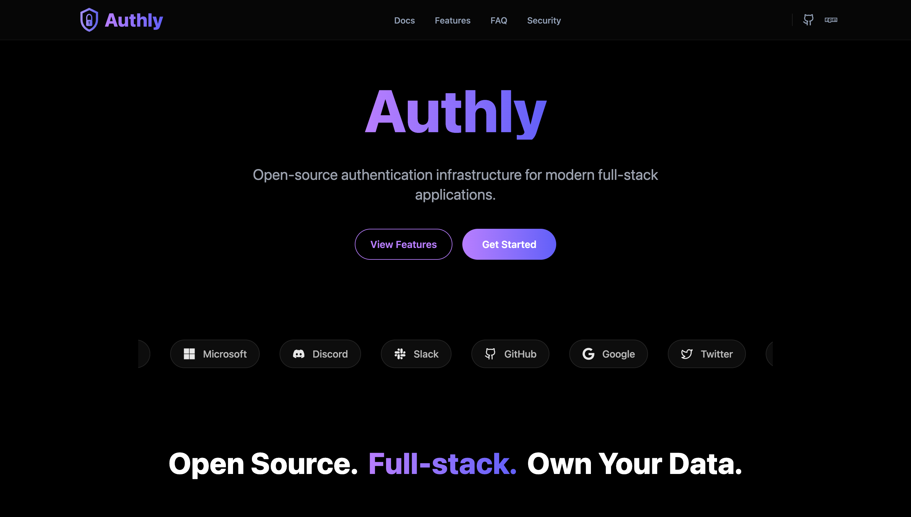

# Authly

Authly is a headless authentication system for modern applications.

It provides:
	•	A self-hosted authentication backend
	•	A JavaScript SDK for frontend & Node.js
	•	Secure JWT authentication with refresh token rotation
	•	Real session management across devices

Authly is not a UI library and not an auth SaaS.
Authly is infrastructure.

⸻

Installation

npm install authly-sdk

⸻

Quick Example

import { AuthlyClient } from "authly-sdk";

const authly = new AuthlyClient({
  baseUrl: "https://api.yourapp.com/api",
});

// Login
await authly.login({
  email: "user@example.com",
  password: "password",
});

// Get current user
const user = await authly.me();

// Logout
await authly.logout();

⸻

How Authly Works

Authly separates authentication into three layers:
	1.	Authly Server
	•	Stores users
	•	Hashes passwords
	•	Issues tokens
	•	Tracks sessions
	2.	Authly SDK
	•	Calls backend APIs
	•	Stores tokens
	•	Refreshes tokens automatically
	•	Exposes a clean API
	3.	You
	•	Build the UI
	•	Send emails
	•	Deploy the backend
	•	Control security policies

⸻

Requirements

Authly requires a backend.
The SDK will not work without an Authly-compatible server.

Backend setup instructions are available in the documentation.

⸻

License

MIT © Prateet Tiwari
